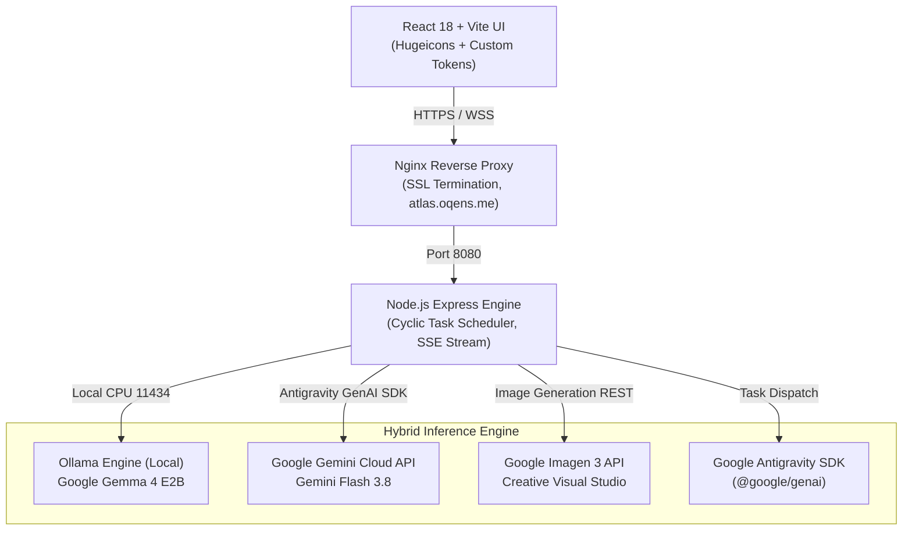

# 🧭 Atlas Agent: Autonomous Executive AI Workstation

<p align="center">
  
  
  
  
  
  
</p>

<p align="center">
  <strong>A privacy-first, low-resource autonomous executive agent powered by Google Gemma 4 E2B and Google Gemini Flash 3.8.</strong>
</p>

<p align="center">
  <a href="https://atlas.oqens.me"><strong>🌐 Live Deployment</strong></a> •
  <a href="#-overview">Overview</a> •
  <a href="#-google-ai-stack--multimodal-features">Google AI Stack</a> •
  <a href="#-architecture">Architecture</a> •
  <a href="#-features">Features</a> •
  <a href="#-installation--setup">Setup</a> •
  <a href="#-api-reference">API Reference</a>
</p>

---

## 🌟 Overview

**Atlas Agent** is an autonomous executive workstation designed for continuous, proactive assistance. Unlike passive chatbots that sit idle waiting for prompts, Atlas manages a real-time proactive timeline, monitors schedule commitments, executes background routines, generates creative visual assets, and processes speech inputs.

Atlas is engineered around a **hybrid edge-cloud AI architecture**:
- **Local Edge Tier (Google Gemma 4 E2B)**: Executes instant intent parsing, tool routing, and confidential data summarization entirely on-device with zero cloud data egress and zero GPU requirement.
- **Cloud Reasoning Tier (Google Gemini Flash 3.8 + Antigravity GenAI SDK)**: Handles complex cross-context problem solving, high-order strategic synthesis, voice transcription, and image generation.

> **Designed for Resource Constraints**: Fully optimized to run inside a lightweight 2 vCPU, 8 GB RAM virtual machine (e.g., Azure `Standard D2s v3`) without out-of-memory crashes.

---

## ⚡ Google AI Stack & Multimodal Features

```
                                  ┌──────────────────────────────────────────────┐
                                  │            Atlas Orchestrator                │
                                  └──────────────────────┬───────────────────────┘
                                                         │
                        ┌────────────────────────────────┴────────────────────────────────┐
                        ▼                                                                 ▼
      ┌──────────────────────────────────┐                              ┌──────────────────────────────────┐
      │     Local Edge Tier (Ollama)     │                              │   Cloud Multimodal Tier (Google) │
      │        Google Gemma 4 E2B        │                              │      Google Gemini Flash 3.8     │
      ├──────────────────────────────────┤                              ├──────────────────────────────────┤
      │ • PLE (Per-Layer Embeddings)     │                              │ • Antigravity SDK (@google/genai)│
      │ • 2.3B Effective Parameters      │                              │ • High-order Reasoning Brain     │
      │ • 128K Context Window            │                              │ • Native Voice Audio STT / TTS   │
      │ • Private Routing & Summaries    │                              │ • Google Imagen 3 API Generation │
      │ • Zero GPU required (runs on CPU)│                              │ • Server-Sent Events (SSE) Stream│
      └──────────────────────────────────┘                              └──────────────────────────────────┘
```

### 1. Google Gemma 4 E2B (`gemma4:e2b`)
- **Per-Layer Embeddings (PLE)**: Houses 2.3B effective parameters inside a 5.1B total parameter footprint with specialized decoder layer embedding lookups, maximizing memory and cache efficiency.
- **Edge Deployment**: Runs on-device via Ollama on CPU, keeping sensitive executive data, emails, and calendar details on your own private infrastructure.
- **Agentic Routing**: Natively handles prompt routing, quick drafts, calendar event extraction, and tool dispatching.

### 2. Google Gemini Flash 3.8 (`gemini-3.8-flash`)
- **Cloud Reasoning Brain**: Powers deep thinking, executive summaries, multi-turn dialogue, and cross-application synthesis.
- **Google Antigravity SDK (`@google/genai`)**: Integrated directly via the official Google GenAI SDK for low-latency streaming and tool execution.

### 3. Voice Model over API
- **Multimodal Audio Transcription**: Verbatim voice speech-to-text processing via `/api/voice/transcribe`, streaming raw audio bytes directly into Gemini Flash for zero-overhead transcription.
- **Speech Synthesis**: Integrated text-to-speech engine delivering real-time auditory responses for hands-free workstation control.

### 4. Image Generation API (Google Imagen 3)
- **Creative Visual Studio**: Integrated via `/api/image/generate`, allowing executive users to produce marketing visuals, document assets, and social post banners on demand with configurable aspect ratios.

---

## 🏛️ System Architecture



---

## ✨ Features

- **Dynamic Agenda & Live Proactive Timeline**: Continuously tracks daily schedules, active tasks, and context shifts rather than acting as a static chatbot.
- **Omni-Bar Command Interface**: Global command palette with zero-latency Server-Sent Events (SSE) streaming.
- **Autonomous Background Workers**: Background cyclic scheduler that periodically wakes up to organize unread notifications, review pending tasks, and prepare morning executive briefings.
- **Executive Ghostwriting**: High-fidelity drafts for emails, LinkedIn announcements, and project updates that adapt to user style.
- **Workspace Tool Connectors**: Built-in support for Google Workspace (Gmail, Calendar, Meet), LinkedIn, GitHub, and local storage.

---

## 🚀 Installation & Setup

### Prerequisites
- Node.js >= 20.x
- [Ollama](https://ollama.com/) installed and running
- Google Gemini API Key

### 1. Clone Repository
```bash
git clone https://github.com/varshith-dev/Atlas-Agent.git
cd Atlas-Agent
```

### 2. Pull Gemma 4 E2B Model
```bash
ollama pull gemma4:e2b
```

### 3. Configure Backend
```bash
cd backend
npm install
```

Create `.env` file in `backend/`:
```env
PORT=8080
OLLAMA_URL=http://127.0.0.1:11434
DEFAULT_MODEL=gemma4:e2b
AGENT_MODEL=gemma4:e2b
GEMINI_API_KEY=your_gemini_api_key_here
GEMINI_MODEL=gemini-3.8-flash
REASON_MODEL=gemini-3.8-flash
APP_BASE=https://atlas.oqens.me
```

### 4. Configure Frontend
```bash
cd ../frontend
npm install
npm run build
```

### 5. Launch Service
```bash
# Start backend
cd ../backend
npm start
```

---

## 📡 API Reference

| Endpoint | Method | Description |
| :--- | :---: | :--- |
| `/api/health` | `GET` | Returns service status, active model, and Ollama connectivity |
| `/api/chat` | `POST` | Core chat endpoint supporting streaming responses |
| `/api/stream` | `GET` | Server-Sent Events (SSE) real-time streaming channel |
| `/api/voice/transcribe` | `POST` | Transcribes audio payloads using Gemini 3.8 Flash multimodal audio |
| `/api/image/generate` | `POST` | Generates photorealistic and illustrative images via Imagen 3 |
| `/api/tasks` | `GET / POST` | Task management and background queue |
| `/api/timeline` | `GET` | Dynamic agenda timeline events and contextual cues |

---

## 📄 License

This project is licensed under the Apache License 2.0 - see the [LICENSE](LICENSE) file for details.
